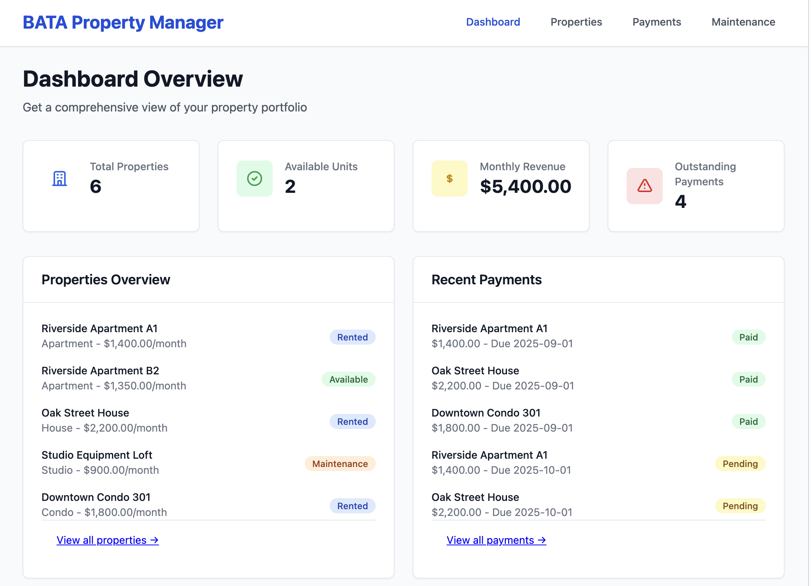
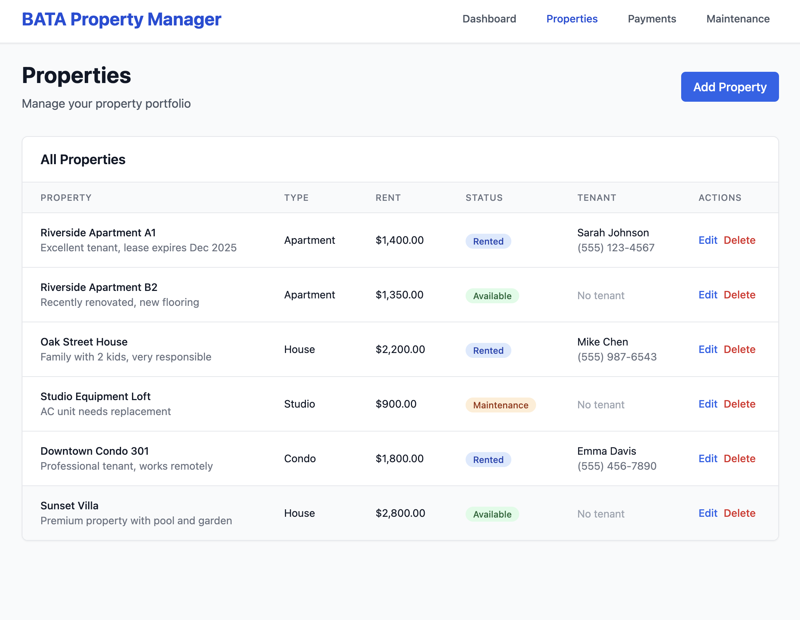
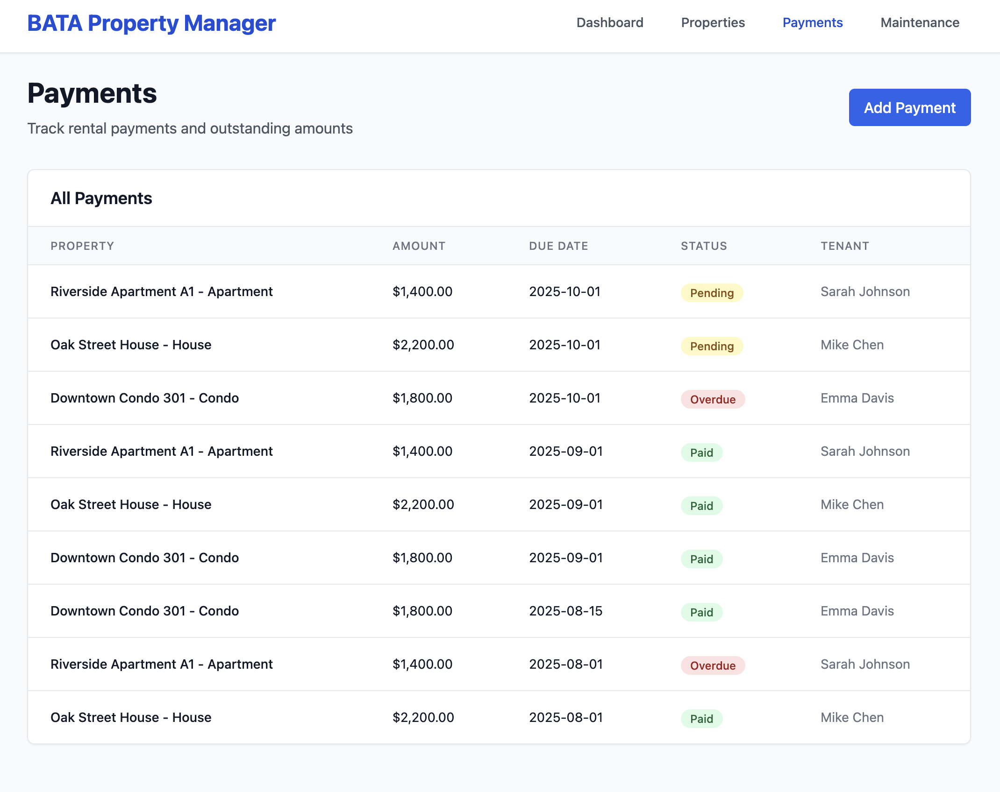
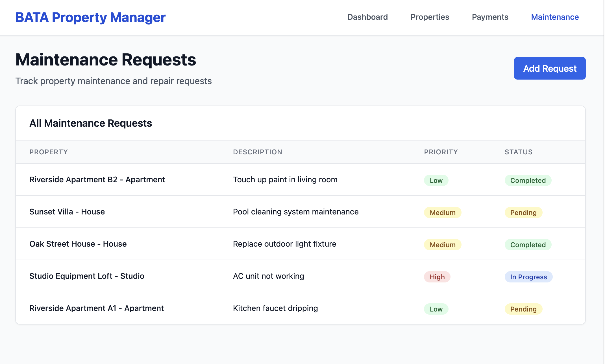

# BATA Property Manager

🏠 **BATA Property Manager** is a SaaS-style web application designed to track properties, tenants, rental payments, and maintenance requests — all from a clean, central dashboard.  

This project demonstrates a **full CRUD dashboard** with multiple modules, making it a strong foundation for SaaS products in property, asset, or client management.

---

## 📊 Features
- **Dashboard Overview**  
  - Displays total properties, available units, monthly revenue, and outstanding payments.  
- **Properties Management**  
  - Add, edit, delete, and track property details.  
- **Payments Tracking**  
  - Record rental payments, track due dates, and mark as Paid / Pending / Overdue.  
- **Maintenance Requests**  
  - Log repair issues, set priority levels, and track status (Pending, In Progress, Completed).  
- **Recent Activity Panels**  
  - Quick view of payments and maintenance requests directly from the dashboard.  

---

## 📸 Screenshots
Dashboard | Properties | Payments | Maintenance
:--: | :--: | :--: | :--:
 |  |  |   

---

## 📂 Repo Structure

bata-property-manager/
│
├── app/                     # Core application logic
│   ├── models/              # Database models (Properties, Payments, Requests)
│   ├── routes/              # API endpoints
│   ├── templates/           # HTML templates (Jinja/React components)
│   └── static/              # CSS, JS, images
│
├── docs/screenshots/        # Project screenshots for README
├── tests/                   # Unit and integration tests
│
├── .gitignore
├── LICENSE
├── README.md
└── requirements.txt         # Dependencies
